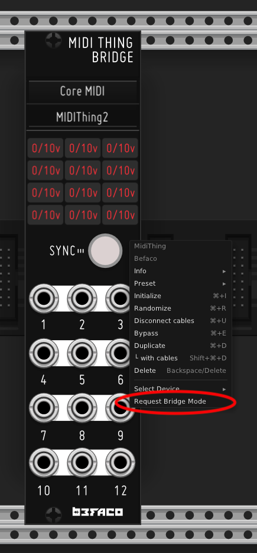
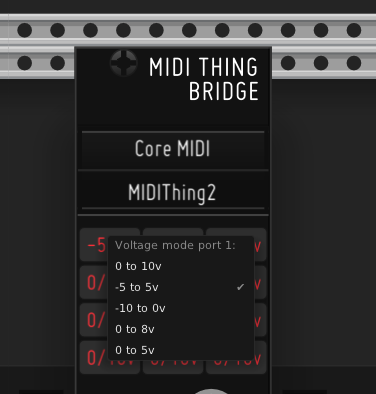

# MIDI Thing v2

The original MIDI Thing v2 hardware unit is described as follows:

> Midi Thing v2 is a flexible MIDI to CV converter. Allowing polyphonic notes handling, envelope and LFO generation as well as all available MIDI messages to be converted into CV. This is a huge upgrade from our previous beloved MIDI Thing, which adds a screen for easy configuration,12 assignable ports, TRS, USB Host and Device, MIDI merge OUT, a web configuration tool, and a VCV rack Bridge counterpart.

The VCV counterpart is designed to allow users to quickly get up and running with their hardware, i.e. sending CV from VCV to the hardware unit. 

## Setup 

To use, first ensure the MIDI Thing v2 is plugged into your computer, and visible as a MIDI device. Then select it, either from the top of the module, or the right click context menu. Then select "Request Bridge Mode" from the context menu - this puts the MIDI Thing into a preset designed to work with VCV Rack. See below for details.

## Usage

To use, simply wire CV which you wish to send to the hardware to the matching input on the VCV module. Note that you will need to select the range, which can be done by right-clicking on the matching box (see below). Options are 0/10v, -5/5v, -10/0v, 0/8v, 0/5v. Note that the module is **not** designed to work with audio rate signals, just CV.

