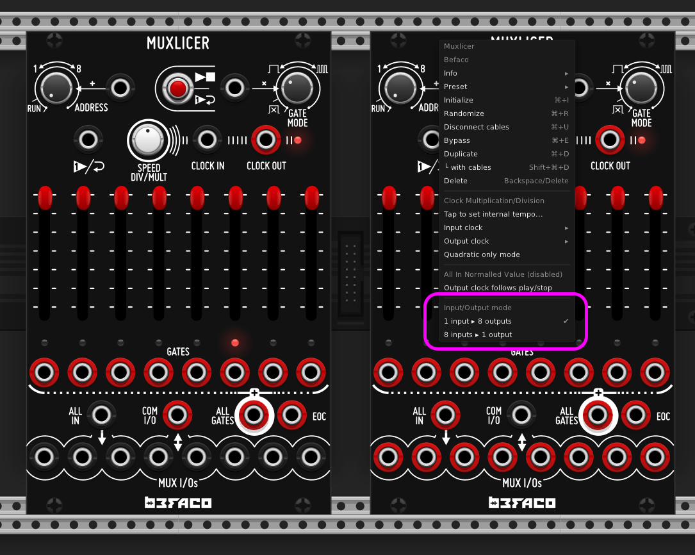
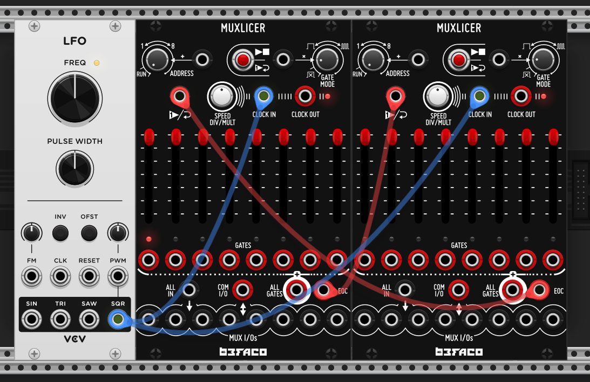

# Muxlicer

The VCV port is designed to be as close as possible to the hardware unit, for which the manual can be found here: https://www.befaco.org/muxlicer-2/. This includes patch ideas and detailed notes.

> Muxlicer is a sequential signal processor designed for add a huge range of special functions to your modular setup in the minimum space. It is divided in three main blocks: a Digital Step Controller, a Gate Generator and an Analog Switch (a.k.a. Mux/DeMux). The module is designed with high “function to HP ratio” philosophy , to have maximum flexibility in minimum space.

## Differences from hardware version

The hardware Muxlicer assigns multiple functions to the "Speed Div/Mult" dial, that cannot be reproduced with a single mouse click. Some of these have been moved to the context menu, specifically: quadratic gates, the "All In" normalled voltage, and the input/output clock division/mult. The "Speed Div/Mult" dial remains only for main clock div/mult.

Tap tempo, which would be obtained by clicking the Speed Div/Mult dial in hardware, is now in the context menu. 

The hardware uses a bidirectional sequential switch, meaning the IO jacks can be inputs or outputs. This is not possible with VCV, so a menu item has been added to allowing changing between "8 in - 1 out" and "1 in - 8 out" modes, see below. The jacks will change colour to indicate the change of mode.

## Patch Ideas

You can chain multiple Muxlicers by linking the End of Cycle (EOC) outputs to the One-Shot/Reset outputs (see below). This works best when both units are externally clocked by the same clock source. 

