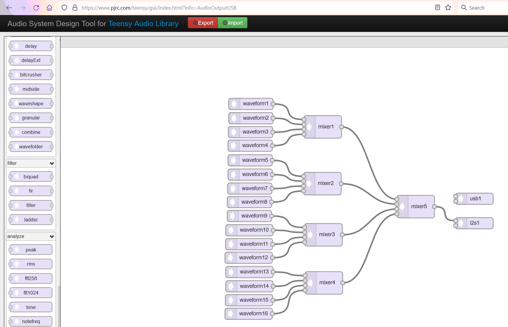
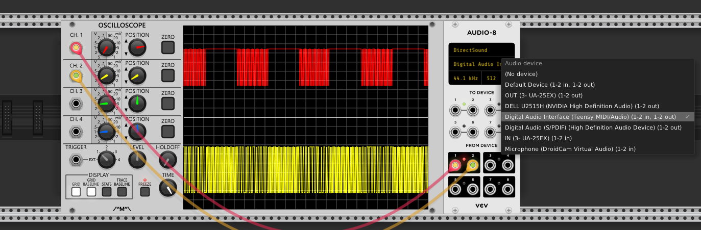

Technical Notes
===============

The Noise Plethora module consists of a number of plugins designed to run on the Teensy microcontroller, and specifically using the powerful [Teensy audio library](https://www.pjrc.com/teensy/td_libs_Audio.html).  This consists of a number of oscillators, filters, noise sources, effects etc. Unfortunately these are designed to run directly on the Teensy, and target ARM processors. A small subset of the library that is required for NoisePlethora has been ported (see `./teensy`), with minor adaptions:

* any parts that only have ARM instructions have been reimplemented (generally with slower versions)
* Teensy fixes the sample rate at 44100Hz, so parts have been updated to allow arbitrary sample rates
* Teensy uses a simple graph based processing approach, where blocks are processed in the order in which they are _declared_ in the C/C++ code. The code to produce and process this graph is too complex to port, so I've instead modify each Teensy unit's `process()` call to take audio blocks as input/output where appropriate, and manually constructed the computation graph by inspection. (In both the original library and the port, every element in the graph is processed once per loop, and some results stored for the next computation where needed).

The VCV plugin will generate 1 block's worth of audio (~2.9ms at 44100Hz), store this in a buffer, and play back sample by sample until the buffer empties and the process is repeated.

An example Teensy plugin is shown below:

I used my own Teensy to debug and try out things quickly in VCV. Teensy provides a usb audio device which Rack trivially recognises (this is useful to allow rapid dev + it decouples Teensy logic from Noise Plethora's filters): 

